# 🍬 Sweet Shop Management System

A full-stack MERN application for managing a sweet shop with separate user and admin interfaces.

## 📌 Assignment

This project is built for the **Incubyte TDD Kata** assignment, demonstrating test-driven development, clean code practices, and modern web development.

## ✨ Features

### 👤 User Features
- User registration and authentication
- Browse sweet catalog
- Search and filter (by name, category, price range)
- Purchase sweets (updates inventory)
- View stock status

### 👨‍💼 Admin Features  
- Admin registration with secret key
- Separate admin dashboard
- Add new sweets
- Update sweet details
- Delete sweets
- Restock inventory
- All user features

## 🛠️ Tech Stack

**Backend:**
- Node.js + Express.js
- MongoDB Atlas
- JWT Authentication
- Bcrypt (password hashing)
- Jest + Supertest (testing)

**Frontend:**
- React.js
- React Router
- Axios
- CSS3 (Responsive design)

## 🚀 Setup Instructions

### Prerequisites
- Node.js (v14+)
- MongoDB Atlas account
- Git

### 1. Clone Repository
```bash
git clone https://github.com/YOUR_USERNAME/sweet-shop-management.git
cd sweet-shop-management
```

### 2. Backend Setup
```bash
cd backend
npm install
```

Create `backend/.env`:
```env
PORT=5000
MONGO_URI=your_mongodb_atlas_uri
JWT_SECRET=your_jwt_secret
ADMIN_SECRET=your_admin_secret
NODE_ENV=development
```

Start backend:
```bash
npm run dev
```

### 3. Frontend Setup
```bash
cd frontend
npm install
```

Create `frontend/.env`:
```env
REACT_APP_API_URL=http://localhost:5000/api
```

Start frontend:
```bash
npm start
```

### 4. Access Application
- User: http://localhost:3000/login
- Admin: http://localhost:3000/admin/login

## 🧪 Running Tests
```bash
cd backend
npm test
```

Test coverage includes:
- ✅ User registration and login
- ✅ Admin registration and login  
- ✅ CRUD operations for sweets
- ✅ Search and filter
- ✅ Purchase functionality
- ✅ Restock (admin only)
- ✅ Delete (admin only)

## 📁 Project Structure
```
sweet-shop/
├── backend/
│   ├── controllers/      # Request handlers
│   ├── services/        # Business logic
│   ├── models/          # MongoDB schemas
│   ├── routes/          # API routes
│   ├── middleware/      # Auth middleware
│   ├── test/            # Jest tests
│   └── server.js
├── frontend/
│   ├── src/
│   │   ├── components/  # React components
│   │   ├── services/    # API calls
│   │   └── App.js
│   └── public/
└── README.md
```

## 🔌 API Endpoints

### Auth
- `POST /api/auth/register` - User registration
- `POST /api/auth/login` - User login
- `POST /api/auth/admin/register` - Admin registration (requires secret)
- `POST /api/auth/admin/login` - Admin login

### Sweets (Protected)
- `GET /api/sweets` - Get all sweets
- `GET /api/sweets/search?name=&category=&minPrice=&maxPrice=` - Search
- `POST /api/sweets` - Add sweet
- `PUT /api/sweets/:id` - Update sweet
- `DELETE /api/sweets/:id` - Delete sweet (Admin)
- `POST /api/sweets/:id/purchase` - Purchase sweet
- `POST /api/sweets/:id/restock` - Restock (Admin)

## 📸 Screenshots : See in Screenshot Folder

### User Login
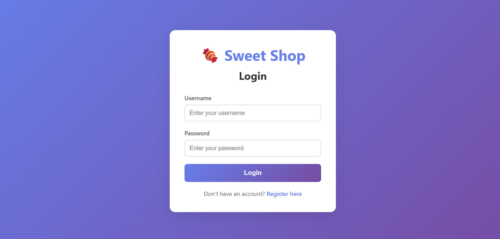

### Dashboard
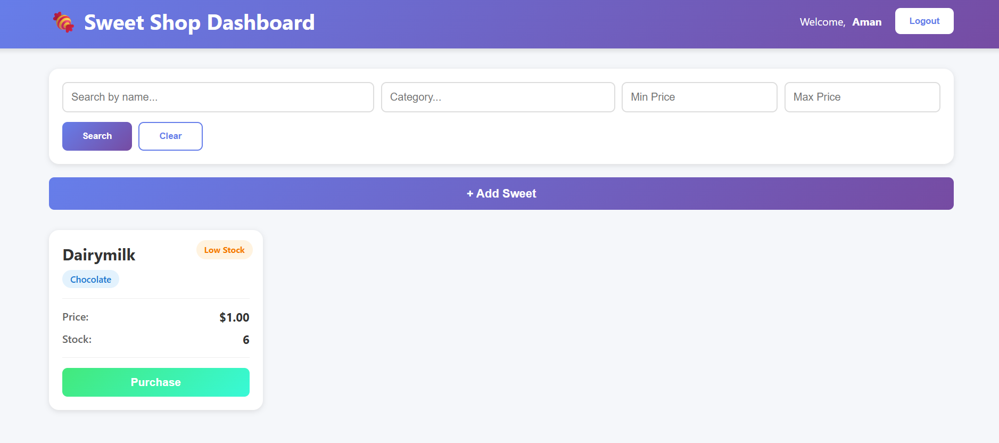

##Sweet-Search
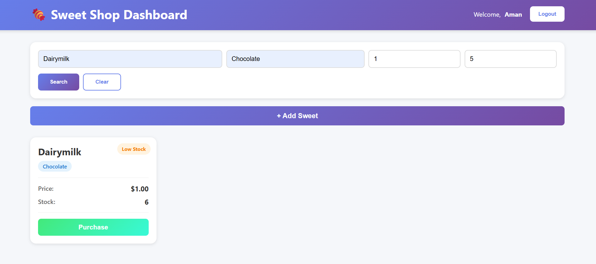

##Sweet-Add
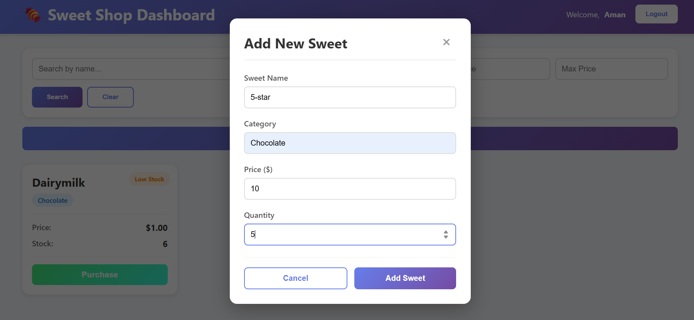

##After-Sweet-Add
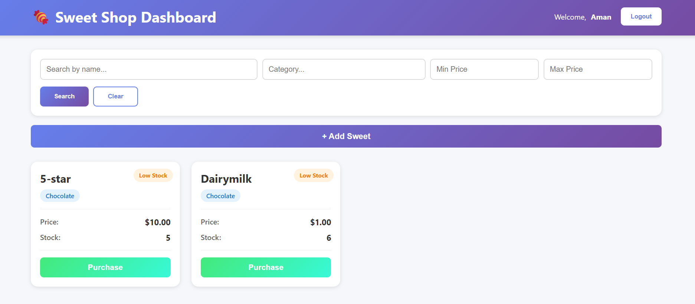

##Sweet-Purchase


##Sweet-Purchase


##Admin-Login


##Sweet-Search
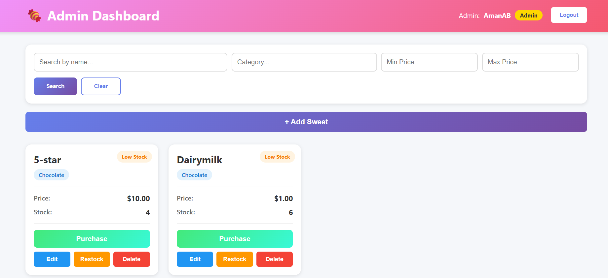

##Sweet-Add-Admin
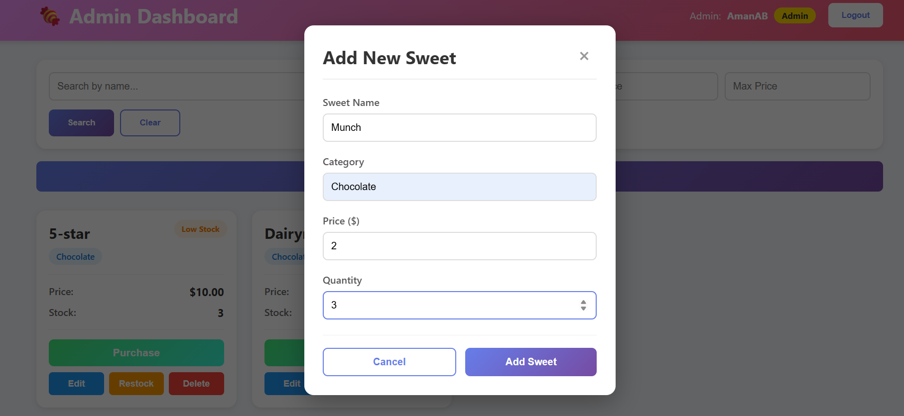

##Sweet-Add-Admin
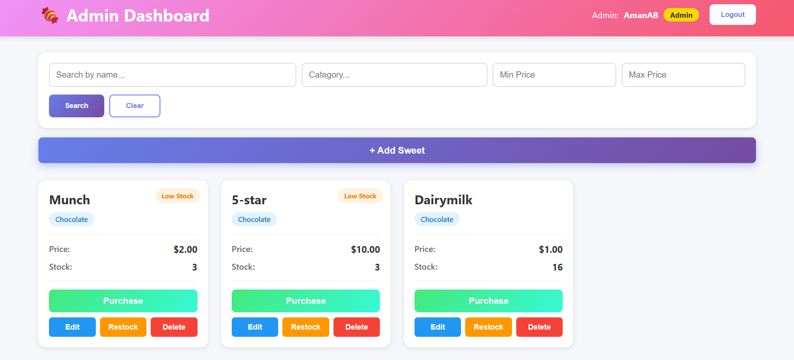

##Sweet-Delete
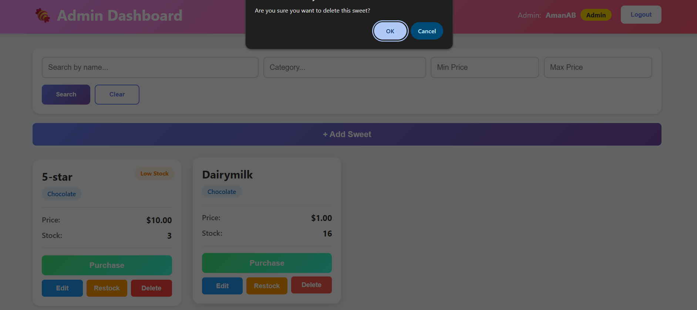

##Sweet-Edit
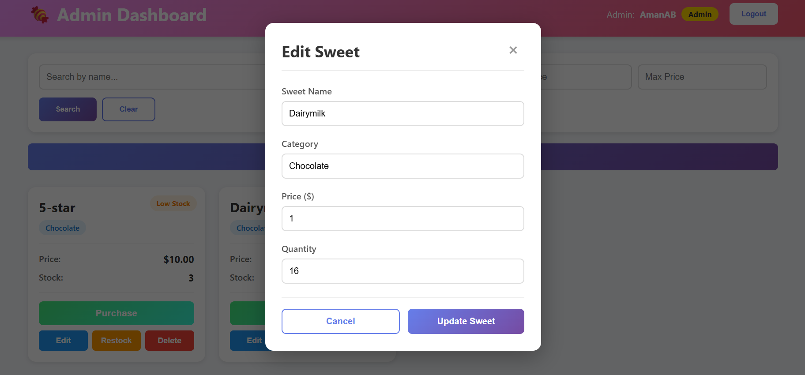

##Sweet-restoke
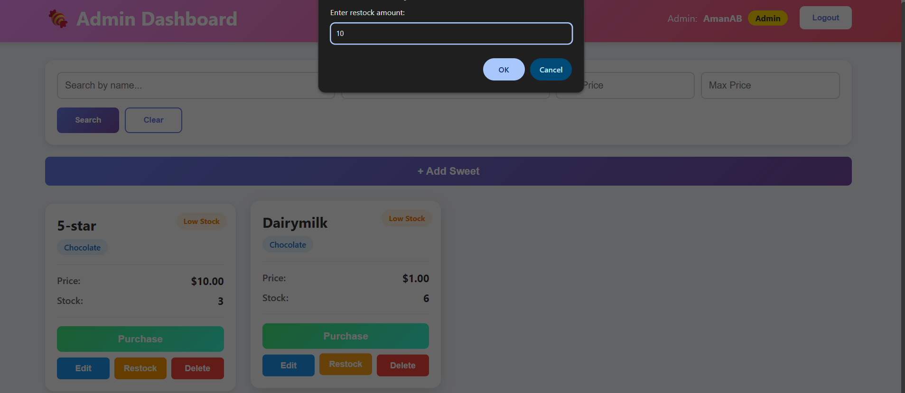


## 🤖 My AI Usage

### Tools Used
- **Claude AI (Anthropic)** - Used as a development assistant for specific tasks

### How I Used AI (Strategically)

I used AI as a **productivity tool** for repetitive and time-consuming tasks, while I focused on core logic, architecture decisions, and business requirements.

#### 1. **Boilerplate Code Generation** (20% AI, 80% Manual)
- Generated initial Express route structure
- Created basic React component templates
- **What I did:** Customized all logic, added validation, error handling, and business rules

#### 2. **Test Case Templates** (30% AI, 70% Manual)
- AI suggested test structure and common test patterns
- Generated basic Jest test templates
- **What I did:** Wrote all test assertions, edge cases, and TDD logic myself. Followed Red-Green-Refactor cycle independently.

#### 3. **Documentation & Comments** (50% AI, 50% Manual)
- Used AI to draft initial README structure
- Generated JSDoc comments for functions
- **What I did:** Rewrote all descriptions to match actual implementation, added setup steps myself

#### 4. **Debugging Assistance** (AI as Stack Overflow Alternative)
- Used AI to understand error messages (import/export issues, CORS errors)
- Asked for common solutions to known problems
- **What I did:** Applied fixes manually, understood root cause, tested thoroughly

#### 5. **CSS & Styling Suggestions**
- Asked for responsive CSS patterns
- Got color scheme suggestions
- **What I did:** Implemented all designs myself, customized for UX requirements

### What AI Did NOT Do

✅ **I designed** the entire system architecture  
✅ **I wrote** all business logic (auth flow, purchase logic, inventory management)  
✅ **I implemented** the TDD approach (test-first development)  
✅ **I made** all technical decisions (MongoDB vs SQL, JWT implementation, routing structure)  
✅ **I debugged** complex issues and understood the codebase deeply  
✅ **I tested** all features manually and wrote integration tests  

### My Development Process
```
1. Understand requirement → I analyzed the problem
2. Design solution → I created architecture 
3. Write tests first → I wrote test cases (TDD)
4. Ask AI for boilerplate → AI generated template
5. Implement logic → I wrote actual code
6. Debug & refactor → I fixed issues
7. Commit with AI credit → Transparent attribution
```

### Key Takeaway

AI was my **coding assistant**, not my **developer**. I used it like:
- A junior developer for repetitive tasks
- Stack Overflow for quick answers
- A code reviewer for suggestions

**I own and understand every line of code in this project.**

### Specific Examples

**Example 1: User Registration**
```
❌ AI did NOT: Design the registration flow
✅ I designed: Password validation, duplicate username check, admin secret key logic
🤝 AI helped: Generated bcrypt boilerplate
✅ I customized: Error messages, response format, MongoDB schema
```

**Example 2: Search Functionality**
```
❌ AI did NOT: Design the search algorithm
✅ I designed: MongoDB query logic with multiple filters
🤝 AI helped: Suggested regex pattern for case-insensitive search
✅ I implemented: Combined name, category, price range filters
```

**Example 3: Admin Dashboard**
```
❌ AI did NOT: Design the UI/UX
✅ I designed: Complete admin vs user separation
🤝 AI helped: Generated React component structure
✅ I implemented: All CRUD operations, modal logic, state management
```

### Transparency in Commits

Every commit where AI assisted includes co-authorship:
```bash
Co-authored-by: AI 
```

This shows I used AI **transparently and ethically**.

### Reflection

**Benefits:**
- 30% faster development on boilerplate
- Quick answers to syntax questions
- Saved time on documentation formatting

**Limitations I Experienced:**
- AI couldn't understand my specific business logic
- Had to debug and fix AI-generated code often
- Still needed to read documentation myself
- Gained deeper understanding by implementing manually

**My Learning:**
Using AI taught me to be more efficient, but I realized that **understanding fundamentals is crucial**. AI can't replace a developer's problem-solving skills and architectural thinking.

I'm comfortable discussing any part of this codebase in detail because **I built it**, AI just helped with scaffolding.
## 🎓 TDD Approach

This project follows strict TDD principles:
1. ✅ Write test first (Red)
2. ✅ Write minimal code to pass (Green)
3. ✅ Refactor while keeping tests passing

Git commit history reflects this approach with clear test commits followed by implementation.

## 🔐 Admin Access

To create an admin account:
1. Go to `/admin/register`
2. Use the `ADMIN_SECRET` from your `.env` file
3. Login at `/admin/login`

## 📧 Contact

**Aman Bhagat**  
Email: amanbhagat.191@gmail.com  
GitHub: [@AmanAB-9162](https://github.com/AmanAB-9162)
Contact no. : +91-9162182297

## 📝 Assignment Submission

- ✅ Test-driven development
- ✅ Clean code practices
- ✅ SOLID principles
- ✅ RESTful API design
- ✅ Authentication & authorization
- ✅ Responsive frontend
- ✅ Comprehensive tests
- ✅ AI usage documentation
- ✅ Clear commit history with AI co-authorship

---
